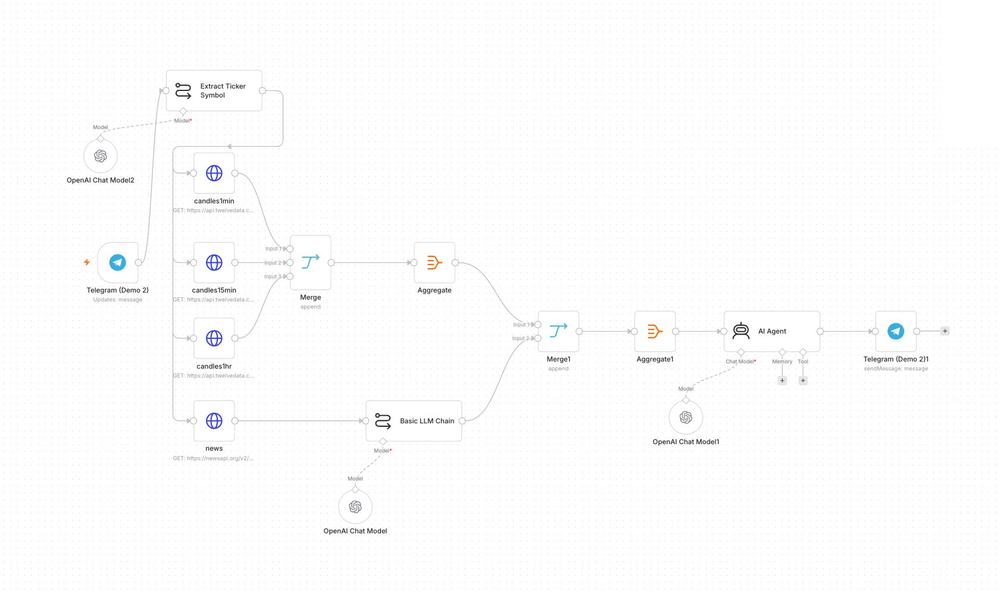
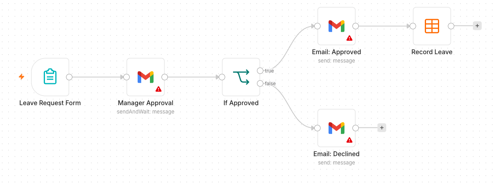

# Agentic AI Automation with n8n — Step-by-Step Learner Guide

**Course Code:** TGS-2023035977  ·  **Version 3.0**  ·  Tertiary Infotech Academy Pte Ltd

### Document Version Control Record

| Version | Effective Date | Summary of Changes | Author |
| --- | --- | --- | --- |
| 1.0 | 2 Feb 2023 | First version | Dr. Alfred Ang |
| 2.0 | 16 June 2025 | Updated course title and content | Tertiary Infotech Pte Ltd |
| 3.0 | 24 June 2026 | Restructured to 8 activities; aligned to the agentic n8n flow (Telegram agents, RAG, webhooks, APIs, guardrails); MD and DOCX aligned | Tertiary Infotech Academy Pte Ltd |

## Table of Contents

- [0. Before You Start — Setup & Prerequisites](#0-before-you-start-setup-&-prerequisites)
- [Activity 1 — Flyer with QR Code (Form → Email)](#activity-1-flyer-with-qr-code-form-→-email)
- [Activity 2 — Capture Submissions in a Data Table](#activity-2-capture-submissions-in-a-data-table)
- [Activity 3a — Conditional Response (Data Table)](#activity-3a-conditional-response-data-table)
- [Activity 3b — Conditional Response (Google Sheets / Excel)](#activity-3b-conditional-response-google-sheets--excel)
- [Activity 4a — Telegram-Triggered AI Agent (Customer Service)](#activity-4a-telegram-triggered-ai-agent-customer-service)
- [Activity 4b — Telegram Agent + Data Table Tool (HR Admin)](#activity-4b-telegram-agent-+-data-table-tool-hr-admin)
- [Activity 5 — Add RAG to the Telegram Agent (Two Knowledge Sources)](#activity-5-add-rag-to-the-telegram-agent-two-knowledge-sources)
- [Activity 5b — RAG with Pinecone (Persistent Vector Database)](#activity-5b-rag-with-pinecone-persistent-vector-database)
- [Activity 6 — Website Chatbot via Webhook (Investment Advisor)](#activity-6-website-chatbot-via-webhook-investment-advisor)
- [Activity 7 — Finance API → Telegram (AI Day-Trading Agent)](#activity-7-finance-api-→-telegram-ai-day-trading-agent)
- [Activity 8a — Human-in-the-Loop Approval (Leave Application)](#activity-8a-human-in-the-loop-approval-leave-application)
- [Activity 8b — Pre & Post Guardrails for the AI Agent](#activity-8b-pre-&-post-guardrails-for-the-ai-agent)
- [Mini Capstone Project](#mini-capstone-project)
- [Troubleshooting Cheat-Sheet](#troubleshooting-cheat-sheet)
- [Glossary](#glossary)

Welcome! This guide takes you click-by-click through every hands-on lab in the WSQ course **Agentic AI Automation with n8n** (Course Code: TGS-2023035977). Over three days you will go from simple form automations to AI agents, Retrieval-Augmented Generation (RAG), webhooks, external APIs, and finally human-in-the-loop guardrails — then build a mini capstone of your own.

Work through the activities in order: each one builds on the skills (and sometimes the workflow) of the activity before it. Whenever you see a **Test it** box, stop and confirm your workflow behaves as described before moving on.

> **Note:** Course flow at a glance — Day 1: Workflow Automation (Activities 1-3) + AI Agents (Activity 4). Day 2: RAG (Activity 5) · Webhooks (Activity 6) · APIs (Activity 7). Day 3: Security & Guardrails (Activity 8) + Mini Capstone.

---

## 0. Before You Start — Setup & Prerequisites

### 0.1 Accounts & API keys you will need

| Service | Used for | Where to get it |
| --- | --- | --- |
| n8n | The automation platform (all activities) | Cloud trial at n8n.io, or local Docker (see 0.2) |
| Gmail or Outlook | Sending emails (Activities 1-3) | Your existing mailbox; connected via OAuth2 |
| OpenAI API key | LLM for AI agents (Activities 4-8) | platform.openai.com/api-keys (provided in class) |
| Google Gemini API key | Alternative LLM | aistudio.google.com/app/apikey (provided in class) |
| Telegram | Chat trigger for AI agents (Activities 4,5,7) | Telegram app + @BotFather |
| Google account | Google Sheets storage (Activity 3b) | Your Google account (training account provided) |
| Twelve Data | Live market data (Activity 7) | twelvedata.com — free API key |
| NewsAPI | Headlines & sentiment (Activity 7) | newsapi.org — free API key |

### 0.2 Run n8n — Cloud trial OR local Docker

You have two ways to run n8n. For the course we start everyone on a **cloud trial** so we are productive immediately, and we also show how to **self-host locally with Docker** so you can keep your workflows after the trial ends.

**Option A — Cloud trial (fastest).** Sign up at n8n.io, create a workspace, and you land directly in the workflow editor. Note: trial **Data Tables are not permanent** — for anything you want to keep, store it externally (e.g. Google Sheets, see Activity 3b).

**Option B — Local install with Docker Compose (persistent).** Install Docker Desktop, then create a file named `docker-compose.yml` (a ready-made copy is in `labs/n8n-installation/`):

```
# labs/n8n-installation/docker-compose.yml
services:
  n8n:
    image: docker.n8n.io/n8nio/n8n
    restart: always
    ports:
      - "5678:5678"
    environment:
      - N8N_SECURE_COOKIE=false
      - GENERIC_TIMEZONE=Asia/Singapore
    volumes:
      - n8n_data:/home/node/.n8n
volumes:
  n8n_data:
```

1. Open a terminal in the `labs/n8n-installation/` folder.
2. Run `docker compose up -d` to start n8n in the background.
3. Open http://localhost:5678 in your browser and create your owner account.
4. Your workflows and credentials now persist in the `n8n_data` volume, even after restarts.
5. To stop n8n, run `docker compose down` (your data is kept); to update, `docker compose pull` then `up -d` again.

### 0.3 Add your credentials in n8n (do this once)

Credentials are stored separately from workflows so you never paste secrets into nodes. Add them under **Credentials → Add credential**:

- **Gmail / Microsoft Outlook (OAuth2)** — sign in and authorise n8n to send mail on your behalf.
- **OpenAI** — paste your OpenAI API key. (Gemini: add a *Google Gemini (PaLM) API* credential instead.)
- **Telegram** — paste the bot token from @BotFather (see Activity 4a, Step 1).
- **Google Sheets (OAuth2)** — authorise access to your Google Sheets (Activity 3b).
- **HTTP Header Auth / query params** — for Twelve Data & NewsAPI keys (Activity 7).

> **Note:** Imported workflows reference credential *names*, not your actual secrets. After importing any provided `.json`, re-select your own credentials on each node that needs them.

### 0.4 Download the workflows from GitHub

All the finished workflow `.json` files, the mock data (CSV) and the sample documents are in the course GitHub repository — download them so you can import and follow along:

> **Note:** **GitHub repo:** https://github.com/tertiarycourses/TGS-2023035977-Agentic-AI-Automation-with-n8n  ·  every activity lives under the **`labs/`** folder (one folder per activity), each with its workflow JSON, a workflow diagram, and any mock data.

1. Open the repo and click **Code → Download ZIP** (or `git clone` it).
2. Each activity folder under `labs/` contains the importable workflow `.json` and its mock data.
3. In n8n, open the **Workflows** list → **Add workflow** → the **⋯** menu → **Import from File**.
4. Choose the matching `.json`, then re-select your own credentials on each node (OpenAI, Gmail, Telegram, etc.).
5. **Save**, then toggle the workflow **Active** when the activity says to.

---

## Activity 1 — Flyer with QR Code (Form → Email)

**Folder:** `labs/activity1-flyer-form/`

### Goal

Build the smallest useful automation: an n8n **Form** that collects a visitor's details and emails them to an admin. You will then turn the form's URL into a **QR code** and put it on an event flyer.


*Activity 1 workflow — Form Trigger to Gmail*

### What you'll build (2 nodes)

**Form Trigger** → **Gmail (Send)**

### Step-by-step

1. Create a new workflow and name it `Activity 1 — Flyer Form`.
2. Add an **n8n Form Trigger** node. Set a **Form Title** (e.g. "Event RSVP").
3. Add four form fields: **Name** (text), **Email** (email), **Phone** (text), **Message** (textarea). Mark Name and Email required.
4. Add a **Gmail** node, operation **Send a Message**, connected after the Form Trigger.
5. In the Gmail node set **To** = the admin address, **Subject** = `New RSVP from {{ $json.Name }}`.
6. Set the message body to include the submitted fields, e.g. `Name: {{ $json.Name }} / Email: {{ $json.Email }} / Phone: {{ $json.Phone }} / Message: {{ $json.Message }}`.
7. Select your Gmail (or Outlook) credential. **Save** the workflow and toggle it **Active**.
8. Open the Form Trigger node and copy the **Production URL**.

### Make the QR code & flyer

1. Open the QR code generator: https://alfredang.github.io/qrcodegenerator/
2. Paste your form's Production URL and generate the QR code; download it.
3. Place the QR code on a flyer so people can scan to open your form.

> **Note:** Group Activity (3-4 per group): design a real event flyer — e.g. a bowling night — with your form's QR code and a short advert. Review a few past-student examples first, then present your flyer to the class.

> ✅ **Test it:** Scan the QR code with your phone, submit the form, and confirm the admin inbox receives the email.

---

## Activity 2 — Capture Submissions in a Data Table

**Folder:** `labs/activity2-data-table/`

### Goal

Extend Activity 1 so every submission is also **saved** into an n8n **Data Table** — your first taste of storing data, not just forwarding it.


*Activity 2 workflow — Form to Gmail + Data Table*

### What you'll build (3 nodes)

**Form Trigger** → **Gmail (Send)** and **Data Table (Insert row)**

### Step-by-step

1. In n8n open **Data Tables** and create a table named `RSVPs` with columns: Name, Email, Phone, Message.
2. Duplicate your Activity 1 workflow (or continue in it).
3. Add a **Data Table** node, operation **Insert Row**, and connect it after the Form Trigger (alongside Gmail).
4. Map each form field to the matching column using expressions, e.g. Name → `{{ $json.Name }}`.
5. **Save** and keep the workflow **Active**.

> ✅ **Test it:** Submit the form again and confirm a new row appears in the `RSVPs` Data Table and the email still sends.

---

## Activity 3a — Conditional Response (Data Table)

**Folder:** `labs/activity3-conditional/`

### Goal

Add decision-making. Ask "Will you attend?" — if **Yes**, save the date to the Data Table; if **No**, send a polite thank-you email instead.


*Activity 3a workflow — IF routing to Data Table / email*

### What you'll build

**Form Trigger** → **IF** → (true) **Data Table Insert** / (false) **Gmail thank-you**

### Step-by-step

1. Add an **Attending?** field to the form (dropdown: Yes / No).
2. Add an **IF** node after the Form Trigger. Condition: `{{ $json.Attending }}` **equals** `Yes`.
3. On the **true** output, add a **Data Table → Insert Row** node that saves the RSVP (Name, Email, Date).
4. On the **false** output, add a **Gmail** node that sends a friendly "thanks anyway" message.
5. **Save** and keep the workflow **Active**.

> **Note:** Heads-up on persistence: data saved to a trial **Data Table disappears when the trial ends**. To keep it permanently you must store it **externally** — that is exactly what Activity 3b does with Google Sheets.

> ✅ **Test it:** Submit once with Attending = Yes (expect a new Data Table row) and once with No (expect the thank-you email).

---

## Activity 3b — Conditional Response (Google Sheets / Excel)

**Folder:** `labs/activity3-conditional/`

### Goal

Make your data **persistent** by replacing the Data Table with **Google Sheets** (or Excel). Same logic as 3a, but the "Yes" branch now appends a row to a real spreadsheet you keep.


*Activity 3b workflow — IF routing to Google Sheets / email*

### What you'll build

**Form Trigger** → **IF** → (true) **Google Sheets (Append row)** / (false) **Gmail thank-you**

### Step-by-step

1. In Google Drive, create a spreadsheet named `Event RSVPs` with a header row: Name, Email, Phone, Date.
2. Back in n8n, add a **Google Sheets** credential (OAuth2) and authorise it.
3. Take your Activity 3a workflow and on the **true** branch replace the Data Table node with a **Google Sheets → Append Row** node.
4. Select your spreadsheet and sheet, then map each column to the form fields.
5. Leave the **false** branch (thank-you email) unchanged. **Save** and keep **Active**.

> **Note:** Microsoft 365 users can use the **Microsoft Excel 365** node instead of Google Sheets — the steps are the same.

> ✅ **Test it:** Submit with Attending = Yes and confirm a new row is appended to your Google Sheet.

---

## Activity 4a — Telegram-Triggered AI Agent (Customer Service)

**Folder:** `labs/activity4-telegram-agent/`

### Goal

Build your first **AI Agent**: a simple customer-service chatbot you talk to from **Telegram**. The agent uses an LLM, short-term memory, and a system instruction that defines its persona.


*Activity 4a workflow — Telegram-triggered AI Agent*

### Concepts — what makes an AI Agent

- **LLM** — the model that generates replies (OpenAI `gpt-4.1-mini` or Google Gemini).
- **Memory** — remembers the recent conversation so follow-up questions make sense.
- **Tools** — optional actions the agent can call (added in Activity 4b).
- **System Instruction** — the agent's role, tone, and rules.

### Step 1 — Create the Telegram bot

1. In Telegram, open **@BotFather** → `/newbot`, give it a name and username, and copy the **bot token**.
2. In n8n add a **Telegram** credential and paste the token.

### Step 2 — Build the workflow

1. Add a **Telegram Trigger** node (it fires on each incoming message). Select your Telegram credential.
2. Add an **AI Agent** node connected after the trigger.
3. Attach an **OpenAI Chat Model** (or **Google Gemini Chat Model**) as the agent's model.
4. Attach a **Simple Memory** node so the agent recalls the conversation.
5. Write the **System Instruction**, e.g. "You are a friendly customer-service assistant for MyCompany. Answer concisely and politely."
6. Add a **Telegram → Send Message** node after the agent; set **Chat ID** = `{{ $json.message.chat.id }}` and **Text** = the agent's output.
7. **Save** and toggle **Active**.

> ✅ **Test it:** Message your bot in Telegram (e.g. "What are your opening hours?") and confirm it replies.

---

## Activity 4b — Telegram Agent + Data Table Tool (HR Admin)

**Folder:** `labs/activity4-telegram-agent/`

### Goal

Give the agent a **tool**: an employee **Data Table** it can look up. Now the same Telegram bot can answer HR-admin questions like "What department is Alice in?" by querying real data.


*Activity 4b workflow — Agent with a Data Table tool*

### Step-by-step

1. Create a Data Table named `Employees`. Either reuse data from Activity 2, or upload the provided `mock-hr-employees.csv` (100 records) — regenerate it any time with `make_mock_data.py`.
2. Open your Activity 4a workflow.
3. Add a **Data Table Tool** and attach it to the AI Agent's **Tool** input.
4. Point the tool at the `Employees` table and describe it in the tool description, e.g. "Look up employee details by name or department."
5. Update the **System Instruction**: "You are an HR admin assistant. Use the Employees tool to answer questions about staff. If the data is not found, say so."
6. **Save** and keep **Active**.

> ✅ **Test it:** Ask the bot "Which department is <a name from the CSV> in?" and confirm it answers from the table.

---

## Activity 5 — Add RAG to the Telegram Agent (Two Knowledge Sources)

**Folder:** `labs/activity5-rag/`

### Goal

Upgrade the agent with **Retrieval-Augmented Generation (RAG)** so it can answer from **documents** (policy PDFs/FAQs) as well as the **Data Table**. The agent must route to the **right source** for each question.


*Activity 5 workflow — Agent with RAG + Data Table sources*

### Concepts — RAG in one minute

- **Tokenization** — text is split into tokens the model can process.
- **Embeddings** — each chunk of a document becomes a vector (a list of numbers capturing meaning).
- **Vector store** — those vectors are saved so the most relevant chunks can be retrieved for a question.


*How RAG works — User → Prompt → Data Retrieval (search/retrieve over your data sources) → Generator → Response*

### Step-by-step

1. Prepare knowledge documents. Use the provided `MyCompany-HR-SOP.docx` and `MyCompany-IT-Support-FAQ.docx`, or generate fresh ones with Claude Code (e.g. an employee-benefits FAQ or product info).
2. Build the **ingestion** path: an upload point → **Embeddings (OpenAI)** → **Vector Store (Insert)** with a **Default Data Loader** so your documents are embedded and stored.
3. In your Telegram agent, add a **Vector Store** retrieval **tool** (the RAG source) alongside the existing **Data Table** tool — the agent now has **two** data sources.
4. Rewrite the **System Instruction** to route correctly: "Use the **Knowledge Base** tool for policy/FAQ questions and the **Employees** tool for staff-record questions. Never mix the two."
5. **Save** and keep **Active**.

> **Note:** Get a few learners to present their chatbot and show it answering both a policy question (RAG) and a staff-record question (Data Table).

> ✅ **Test it:** Ask a policy question ("How many days of annual leave do I get?") and a record question ("What is Alice's role?") and confirm each is answered from the correct source.

---

## Activity 5b — RAG with Pinecone (Persistent Vector Database)

**Folder:** `labs/activity5-rag/`  ·  workflows `Activity5b-Pinecone-Upload.json` (ingest) + `Activity5b-Pinecone-RAG.json` (chat)

### Goal

Activity 5 used an **in-memory** vector store that resets when the workflow restarts. Here you swap it for **Pinecone**, a managed cloud **vector database**, so your knowledge base **persists** and scales. You upload documents into a Pinecone index once, then the Telegram agent answers from it.


*Activity 5b workflow — Telegram agent answering from a Pinecone vector store (gpt-4.1-mini)*

### Why a vector database (Pinecone)?

- An **in-memory** store is fine for a demo but is lost on restart.
- **Pinecone** stores your embeddings in the cloud — persistent, fast, scales to millions of vectors.
- Same RAG idea: embed documents once, then retrieve the closest chunks for each question.

### Step 1 — Create a Pinecone account

1. Open https://www.pinecone.io/ and click **Sign Up** (the free **Starter** tier is enough for this lab).
2. Register with your email (or Google/GitHub) and verify the account.
3. You land in the **Pinecone console** at https://app.pinecone.io.


*Pinecone — the managed vector database; sign up for the free Starter tier*

### Step 2 — Create an API key and an index

1. In the console, open **API Keys** and **create / copy** an API key (you'll paste it into n8n).
2. Open **Indexes → Create index** and give it a name, e.g. `n8n-course`.
3. Set **Dimensions = 1536** to match OpenAI `text-embedding-3-small` (the embeddings used in this lab).
4. Set **Metric = cosine**, then create the index.

> **Note:** The embedding model on **both** the upload and the chat workflows must be the **same** (here, OpenAI `text-embedding-3-small` = 1536 dims) — otherwise the vector dimensions won't match the index.

### Step 3 — Upload your documents into Pinecone

1. Import `Activity5b-Pinecone-Upload.json`.
2. Add a **Pinecone** credential (paste your API key) and select your `n8n-course` index on the Pinecone node.
3. Add your **OpenAI** credential on the Embeddings node.
4. Provide your documents (e.g. the HR SOP / IT FAQ) and run the workflow to embed and insert them into Pinecone.

### Step 4 — Chat with your Pinecone knowledge base

1. Import `Activity5b-Pinecone-RAG.json` (Telegram → AI Agent + Pinecone Vector Store tool → reply).
2. Select the **same** Pinecone index and credential, your **OpenAI** key (gpt-4.1-mini), and your **Telegram** credential.
3. **Save** and toggle **Active**.

> ✅ **Test it:** Upload a document, then ask the Telegram bot a question only answerable from it — the answer is retrieved from your Pinecone index, and it survives a workflow restart.

---

## Activity 6 — Website Chatbot via Webhook (Investment Advisor)

**Folder:** `labs/activity6-investment-advisor/`  ·  Reference: https://alfredang.github.io/n8n-investmentadvisor/

### Goal

Expose an AI agent to a **public website** using a **Webhook**. The provided one-page Investment Advisor site has an enquiry form and a floating chatbot; both POST to a single n8n webhook, which routes to an email-the-advisor path and an AI-chat path.


*Activity 6 workflow — Webhook chatbot + enquiry*

### Concepts — Webhooks

- A **Webhook** is a URL that external systems (a website, another app) call to **trigger** your workflow.
- Use cases: website chat, form submissions, payment events, GitHub/Stripe notifications — any external trigger.
- Pair the Webhook trigger with a **Respond to Webhook** node to send a reply back to the caller.

### Step-by-step

1. Import `Activity6-Investment-Advisor.json` into n8n.
2. Open the **Webhook** node(s) and ensure **Allowed Origins (CORS)** is `*` so the browser page can call it.
3. Re-select your **OpenAI** and **Gmail** credentials on the AI Agent and Email nodes.
4. Review the agent's compliance system instruction (no guaranteed returns, no personalised advice).
5. **Save**, toggle **Active**, and copy the webhook **Production URL**.
6. Open `index.html` from the activity folder, click the settings/gear, and paste your webhook URL.

> **Note:** Get a few learners to present their live website and chatbot.

> ✅ **Test it:** On the website, send a chat message and submit the enquiry form; confirm the bot replies and the advisor receives the enquiry email.

---

## Activity 7 — Finance API → Telegram (AI Day-Trading Agent)

**Folder:** `labs/activity7-finance-advisor/`  ·  Reference: https://alfredang.github.io/n8n-financeadvisor/

### Goal

Combine **APIs/HTTP Requests** with an AI agent. Ask the Telegram bot about a stock; it resolves the ticker, pulls **multi-timeframe candles from Twelve Data** and **headlines from NewsAPI**, and replies with a Buy / Sell / Hold call and reasoning. A companion dashboard shows live price and charts.



*Activity 7 workflow — Finance API to Telegram day trader*

### Concepts — APIs & HTTP Request

- An **API** lets your workflow request data from another service over HTTP.
- The **HTTP Request** node calls an endpoint with a method (GET/POST), headers, and query parameters.
- **API keys** authenticate you — keep them in credentials, never hard-coded.

### Step A — Get your Twelve Data API key (free)

1. Open https://twelvedata.com/ and click **Sign Up** (the free **Basic** plan is enough for this lab).
2. Register with your email and verify the account.
3. Once logged in, go to **https://twelvedata.com/account/api-keys** (Account → API Keys).
4. Copy the **API key** shown there — you'll paste it into the workflow in Step C.

> **Note:** The free Twelve Data plan allows ~8 requests/minute and ~800 calls/day — plenty for testing. All three candle requests in this activity use the **same** Twelve Data key.


*Twelve Data home page — click Sign Up, then Account → API Keys to copy your key*

### Step B — Get your NewsAPI key (free)

1. Open https://newsapi.org/ and click **Get API Key**.
2. Register with your email (choose the free **Developer** plan).
3. Your key appears on your account page at **https://newsapi.org/account** — copy it.


*NewsAPI home page — click Get API Key and register for the free Developer plan*

### Step C — Put the keys into the workflow

Import `Activity7-Finance-Advisor.json` into n8n, then set the keys. **Twelve Data** and **NewsAPI** are configured in two different ways:

**C1 — Twelve Data (3 HTTP Request nodes).** The key is a query parameter you paste directly:

1. Open the **candles1min** node (an HTTP Request node).
2. Scroll to **Query Parameters** and find the parameter named **`apikey`**.
3. Replace its value `YOUR_TWELVEDATA_API_KEY` with the key you copied from Twelve Data.
4. Repeat for **candles15min** and **candles1hr** — all three call Twelve Data and need the same key.

> **Note:** Tip — set it once: create a **Query Auth** credential (Name = `apikey`, Value = your Twelve Data key), then on each candle node set **Authentication → Generic Credential Type → Query Auth** and delete the inline `apikey` parameter. That way the key lives in one place.

**C2 — NewsAPI (the `news` node).** The key is stored as a credential:

1. Open the **news** HTTP Request node. **Authentication** is already set to **Generic Credential Type → Query Auth**.
2. Click the **Credential** dropdown → **Create New Credential**.
3. Set **Name** = `apiKey` and **Value** = your NewsAPI key, then **Save**. (NewsAPI expects the key in a query parameter called `apiKey`.)
4. Back on the `news` node, make sure your new credential is selected.

### Step D — Finish & run

1. Re-select your own **OpenAI** and **Telegram** credentials on the model and Telegram nodes.
2. Review the flow: **Telegram Trigger → Extract Ticker (LLM) → HTTP candles (1m/15m/1h) + HTTP news → Aggregate/Merge → AI Agent → Telegram reply**.
3. **Save** the workflow and toggle it **Active**.
4. *(Optional)* open `index.html`, click the gear, and paste your Twelve Data key + Telegram bot username for the dashboard.

> ✅ **Test it:** Message the bot "Should I buy AAPL?" and confirm it returns a recommendation with reasoning. If you get a 401/429 from an HTTP node, re-check the corresponding API key (401 = wrong key, 429 = rate limit).

---

## Activity 8a — Human-in-the-Loop Approval (Leave Application)

**Folder:** `labs/activity8-guardrails/`

### Goal

Add a **human approval** step so the automation pauses for a person to decide. We model a **leave-application approval**: a request comes in, a manager is asked to approve, and the flow only continues on approval.



*Activity 8a workflow — human-in-the-loop approval*

### Concepts — Human in the Loop

- Some actions are too sensitive to fully automate — money, hiring, sending on someone's behalf.
- A **human-in-the-loop** step pauses the workflow and waits for a person to **Approve** or **Reject**.
- n8n provides **Send and Wait for Response** (e.g. via email/Telegram) to capture that decision.

### Step-by-step

1. Start a workflow with a **Form Trigger** (or Telegram) collecting: Employee, Dates, Reason.
2. Add a **Gmail → Send and Wait for Response** (Approval) node addressed to the manager, with **Approve** / **Reject** buttons.
3. On **Approved**, record the leave (Data Table or Google Sheet) and email a confirmation to the employee.
4. On **Rejected**, email the employee that the request was declined.
5. **Save** and keep **Active**.

> **Note:** Get a few learners to present their approval flow.

> ✅ **Test it:** Submit a leave request, approve it from the manager email, and confirm the employee gets a confirmation.

---

## Activity 8b — Pre & Post Guardrails for the AI Agent

**Folder:** `labs/activity8-guardrails/`

### Goal

Wrap an AI agent with **guardrails** so unsafe input never reaches the model and unsafe output never reaches the user. You add a **pre-check** before the agent and a **post-check** after it.


*Activity 8b workflow — pre/post guardrails around the agent*

### Concepts — Guardrails

- **Pre-guardrail** — validate/sanitise the *input* (block prompt-injection, PII, banned topics) before the LLM.
- **Post-guardrail** — check the *output* (no secrets, no disallowed content) before it is sent.
- If a guardrail fails, route to a safe fallback (a canned reply, or human review).

### Step-by-step

1. Take the Activity 6 webhook agent (or the Telegram agent).
2. **Before** the AI Agent, add a check node (a Guardrails   node, or an LLM/If classifier) that inspects the user message for Secret keys , where you can also add extra guardrails as per your wish.
3.	**After** the AI Agent, add a second check that scans the reply for keywords, violations; on a violation, feel free to change the keywords in the second guardrail and play around with it. (or send it for human review as in 8a).
4.	If either of the guardrail fails it will reply with the false branch.
5.	Only send the reply to the user when both guardrails pass.
6.	**Save** and keep **Active**.


> ✅ **Test it:** Send a normal question (passes through) and a disallowed one - send a message containing secret keys like (“my password is sk-12345678”) and another message containing keywords that you blocked (blocked by the pre-guardrail with a safe reply).

---

## Mini Capstone Project

**Folder:** `labs/mini-capstone/`

### Goal

Bring it together. In small groups, design and build an end-to-end automation that uses what you learned: a trigger (form/Telegram/webhook), an AI agent with at least one **tool** or **RAG** source, an external **API** or storage, and a **guardrail** or human-in-the-loop step. A worked example — an **Issue Reporting** flow (form + image → Postgres, with a retrieval API and gallery) — is provided in the folder.

### Deliverables

- A working n8n workflow (exported `.json`).
- A short demo of the happy path and at least one safety/guardrail case.
- A 3-5 minute presentation: problem, design, what you'd improve.

### Assessment

Your capstone and the activities across the three days are assessed against the course learning outcomes: workflow design, AI agent / RAG integration, webhook & API use, and the application of security guardrails.

---

## Troubleshooting Cheat-Sheet

| Symptom | Likely cause & fix |
| --- | --- |
| Browser page can't reach the webhook | Set the Webhook node's **Allowed Origins (CORS)** to `*`; use the **Production** URL with the workflow Active. |
| Imported workflow errors on run | Re-select your own credentials on every node; imported credential IDs won't match. |
| AI agent gives empty/odd replies | Check the model credential is valid and the System Instruction is set; confirm Memory is attached. |
| Telegram bot doesn't respond | Workflow must be **Active**; the Telegram credential token must match the bot; check the chat ID expression. |
| Data Table data disappeared | Trial Data Tables are not permanent — use Google Sheets/Excel (Activity 3b) for persistence. |
| API returns 401/429 | 401 = wrong/missing API key; 429 = rate limit — wait, or reduce request frequency. |

---

## Glossary

| Term | Meaning |
| --- | --- |
| Trigger | The node that starts a workflow (Form, Webhook, Telegram, Schedule, Manual). |
| Node | A single step/block in a workflow (an action, a logic gate, a trigger). |
| Action | A node that does something — send email, insert a row, call an API. |
| Flow / Connection | The wires linking nodes, defining execution order and data passing. |
| AI Agent | A node that uses an LLM plus memory and tools to reason and act. |
| LLM | Large Language Model — the AI that understands and generates text. |
| RAG | Retrieval-Augmented Generation — answering from your documents via a vector store. |
| Embedding | A numeric vector representing the meaning of a piece of text. |
| Vector store | A database of embeddings used to retrieve relevant chunks. |
| Webhook | A URL that external systems call to trigger a workflow. |
| Guardrail | A safety check on an agent's input (pre) or output (post). |
| Human in the loop | A pause for a person to approve/reject before the flow continues. |

You're done — congratulations! Keep your local n8n running to continue building your own agents.
