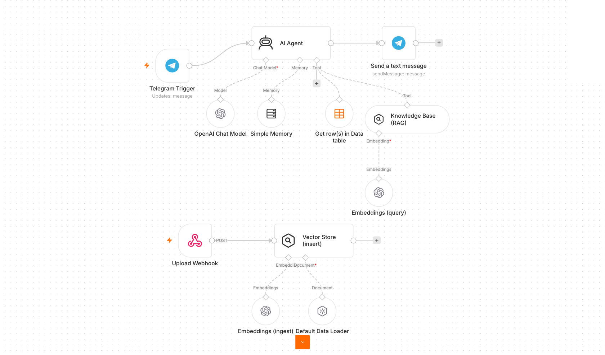
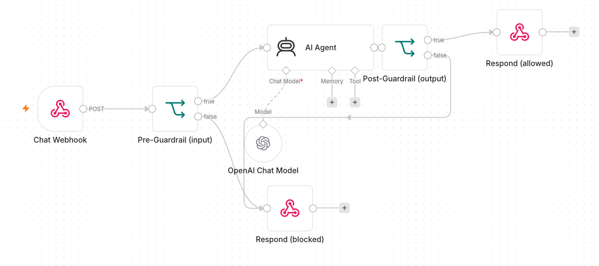

<div align="center">

# Agentic AI Automation with n8n

[](https://www.tertiarycourses.com.sg/wsq-agentic-ai-automation-with-n8n.html)
[](https://n8n.io)
[](https://platform.openai.com)
[](#activity-4--rag-chatbot-with-vector-store--file-upload)
[](#license)

**Hands-on lab workflows and web apps for building agentic AI automations with n8n — from form-to-email flows to a RAG chatbot with a vector store.**

[📘 Course Page](https://www.tertiarycourses.com.sg/wsq-agentic-ai-automation-with-n8n.html) · [📖 Step-by-Step Guide](LEARNER-GUIDE.md) · [🐛 Report Bug](https://github.com/tertiarycourses/TGS-2023035977-Agentic-AI-Automation-with-n8n/issues) · [💡 Request Feature](https://github.com/tertiarycourses/TGS-2023035977-Agentic-AI-Automation-with-n8n/issues)

</div>

> [!NOTE]
> **These are the official hands-on lab materials for the WSQ course:**
> ### 🎓 WSQ — Agentic AI Automation with n8n
> **Course Code:** `TGS-2023035977` · by Tertiary Courses / Tertiary Infotech
> **Course page:** https://www.tertiarycourses.com.sg/wsq-agentic-ai-automation-with-n8n.html

---

## Lab Activities

**Activity 1 — Flyer with QR Code** · Form Trigger → Gmail + QR code on an event flyer.


**Activity 2 — Capture Submissions in a Data Table** · Every form submission saved to an n8n Data Table alongside the email.


**Activity 3 — Conditional Response** · IF-node routing: "Yes" saves to Data Table (3a) / Google Sheets (3b), "No" sends a thank-you email.


**Activity 4 — Telegram AI Agent** · Telegram-triggered AI agent with memory (4a) + a Data Table tool for HR lookups (4b).


**Activity 5 — RAG Telegram Agent** · Agent routes between a Vector Store knowledge base and a Data Table — two sources, one bot.


**Activity 6 — Website Chatbot via Webhook** · Investment Advisor site with an enquiry form and floating AI chatbot, both wired to one n8n webhook.


**Activity 7 — Finance API → Telegram (Day Trader)** · Pulls Twelve Data candles + NewsAPI headlines, then replies with a Buy/Sell/Hold call. Live demo: <https://tertiarycourses.github.io/TGS-2023035977-Agentic-AI-Automation-with-n8n/>


**Activity 8 — Security & Guardrails** · Human-in-the-loop leave approval (8a) and pre/post guardrails around the AI agent (8b).


---

## About

This repository contains the complete, working lab materials for the **WSQ Agentic AI Automation with n8n** course (**TGS-2023035977**) by Tertiary Courses / Tertiary Infotech. Each activity is a self-contained, importable [n8n](https://n8n.io) workflow — several paired with a polished HTML front end — that builds progressively from basic automation to a full **Retrieval-Augmented Generation (RAG)** agent.

### What you'll learn

| # | Activity | Concepts |
|---|----------|----------|
| **1** | **Flyer with QR Code** | Form Trigger → Gmail, expressions, QR-code generation |
| **2** | **Capture Data in a Data Table** | n8n Data Tables, storing submissions |
| **3a / 3b** | **Conditional Response** | IF-node branching → Data Table (3a) / Google Sheets persistence (3b) |
| **4a / 4b** | **Telegram AI Agent** | Telegram Trigger, AI Agent + `gpt-4.1-mini`, memory, Data Table tool |
| **5** | **RAG Telegram Agent** | Tokenization, embeddings, vector store, routing between two knowledge sources |
| **6** | **Website Chatbot (Investment Advisor)** | Webhook trigger, CORS, `Respond to Webhook`, branded front end |
| **7** | **Finance API → Telegram (Day Trader)** | HTTP Request, Twelve Data + NewsAPI, multi-timeframe analysis |
| **8a / 8b** | **Security & Guardrails** | Human-in-the-loop approval, pre/post guardrails around the agent |
| **Capstone** | **Mini Capstone** | End-to-end build (Issue Reporting: form + image → Postgres) |

> 📖 **Full walkthrough:** see **[LEARNER-GUIDE.md](LEARNER-GUIDE.md)** for detailed, click-by-click instructions (with workflow diagrams) for every activity, plus a troubleshooting cheat-sheet and glossary. Slides, the Learner Guide and the Lesson Plan are in [`courseware/`](courseware/).

---

## Tech Stack

| Category | Technology |
|----------|------------|
| **Automation Platform** | [n8n](https://n8n.io) (cloud trial or local Docker; workflows, triggers, Data Tables) |
| **LLM** | OpenAI **`gpt-4.1-mini`** (all agents) + `text-embedding` embeddings; Google Gemini optional |
| **Agent Framework** | n8n LangChain nodes (AI Agent, Memory, Vector Store) |
| **Chat / Messaging** | Telegram (Bot trigger + send) |
| **Tools & Data** | n8n Data Table, In-Memory Vector Store, Twelve Data + NewsAPI (HTTP) |
| **Email / Storage** | Gmail (OAuth2), Google Sheets |
| **Front End** | Vanilla HTML / CSS / JavaScript (no build step) |
| **Courseware** | Slides (`python-pptx`), Learner Guide + Lesson Plan (`python-docx`), workflow diagrams (`matplotlib`) |

---

## Architecture

```
DAY 1 — Workflow Automation + AI Agents
  Act 1  Form Trigger ─▶ Gmail                         (flyer + QR code)
  Act 2  Form Trigger ─▶ Gmail + Data Table            (capture data)
  Act 3a Form ─▶ IF ─▶ Data Table / Gmail              (conditional)
  Act 3b Form ─▶ IF ─▶ Google Sheets / Gmail           (persistent)
  Act 4a Telegram ─▶ AI Agent (gpt-4.1-mini + memory) ─▶ reply
  Act 4b Telegram ─▶ AI Agent + Data Table tool ─▶ reply

DAY 2 — RAG · Webhooks · APIs
  Act 5  Telegram ─▶ AI Agent ─┬─ Vector Store (RAG)    (two sources,
                               └─ Data Table tool        routed by prompt)
  Act 6  Website ─▶ Webhook ─▶ AI Agent ─▶ Respond       (Investment Advisor)
  Act 7  Telegram ─▶ HTTP (Twelve Data + NewsAPI) ─▶ AI Agent ─▶ reply  (Day Trader)

DAY 3 — Security & Guardrails + Capstone
  Act 8a Form ─▶ Manager Approval (Send & Wait) ─▶ IF ─▶ confirm / decline
  Act 8b Webhook ─▶ Pre-check ─▶ AI Agent ─▶ Post-check ─▶ Respond / Blocked
  Capstone  Issue Reporting: Form + image ─▶ Postgres + retrieval API + gallery
```

---

## Project Structure

```
TGS-2023035977-Agentic-AI-Automation-with-n8n/
├── LEARNER-GUIDE.md                  # Full step-by-step lab guide (start here)
├── README.md
├── screenshot.png                   # Live Finance Advisor dashboard (Activity 7)
│
├── labs/                            # All hands-on lab activities (one folder each)
│   ├── n8n-installation/            # Docker Compose for self-hosting n8n
│   ├── activity1-flyer-form/        # Act 1: Form → Gmail (+ flyer samples)
│   ├── activity2-data-table/        # Act 2: + Data Table (+ rsvp-sample.csv)
│   ├── activity3-conditional/       # Act 3a/3b: IF → Data Table / Google Sheets
│   ├── activity4-telegram-agent/    # Act 4a/4b: Telegram AI agent (+ employees.csv)
│   ├── activity5-rag/               # Act 5: Telegram + RAG (+ SOP/FAQ docs, CSVs)
│   ├── activity6-investment-advisor/# Act 6: Webhook website chatbot (HTML app)
│   ├── activity7-finance-advisor/   # Act 7: Finance API → Telegram (HTML dashboard)
│   ├── activity8-guardrails/        # Act 8a/8b: human-in-the-loop + guardrails
│   └── mini-capstone/issue-tracking/# Capstone: Form + image → Postgres + gallery
│       (each activity folder = workflow .json + a workflow diagram .png + mock data)
│
└── courseware/                      # Course slides, Lesson Plan + Learner Guide
    ├── n8n-slides.pptx                                    # 154-slide 3-day deck
    ├── n8n Automation Learner Guide.docx                  # detailed step-by-step (DOCX)
    └── Lesson Plan - Agentic AI Automation with n8n.docx  # 3-day lesson plan
```

---

## Getting Started

### Prerequisites
- An [**n8n**](https://n8n.io) account (Cloud or self-hosted)
- An [**OpenAI API key**](https://platform.openai.com/api-keys)
- A [**Tavily API key**](https://tavily.com) (web-search tool)
- A **Gmail** account (for Activity 1 email)
- A modern browser (for the Activity 3, 4 & 5 web pages)
- *(Optional, for the Issue Reporting mini-capstone)* a **Postgres** database (e.g. [Supabase](https://supabase.com))

### 1. Clone the repo
```bash
git clone https://github.com/tertiarycourses/TGS-2023035977-Agentic-AI-Automation-with-n8n.git
cd TGS-2023035977-Agentic-AI-Automation-with-n8n
```

### 2. Import a workflow into n8n
1. In n8n: **Workflows → Add workflow → ⋯ → Import from File**.
2. Pick a `.json` from the matching `labs/activity*/` folder.
3. Re-select **your own credentials** (OpenAI, Tavily, Gmail) on each node — imported credential IDs won't match yours.
4. **Save**, then toggle **Active / Published**.

### 3. Run the web apps (Activities 3, 4 & 5)
The pages are pure static HTML — just open them, or serve locally:
```bash
cd labs/activity4-rag
python3 -m http.server 8000
# then open http://localhost:8000/index.html
```
- Click the **⚙️ gear** and paste your **chat webhook** production URL.
- In Activity 4, also paste your **upload webhook** URL in the Knowledge Base card, then drag in `MyCompany-HR-SOP.docx` to populate the vector store.
- In Activity 5, populate **both** vector stores: upload `MyCompany-HR-SOP.docx` (HR agent) and `MyCompany-IT-Support-FAQ.docx` (IT agent), then ask an HR or IT question and watch the router dispatch to the right specialist.

> ⚠️ **CORS:** each n8n Webhook node must have **Options → Allowed Origins (CORS) = `*`** so the browser page can call it. All workflow exports in this repo already include this.

For complete, click-by-click setup, see **[LEARNER-GUIDE.md](LEARNER-GUIDE.md)**.

---

## Contributing

Contributions, fixes, and improvements are welcome:

1. **Fork** the repository
2. Create a feature branch: `git checkout -b feature/my-improvement`
3. Commit your changes: `git commit -m "Add my improvement"`
4. Push the branch: `git push origin feature/my-improvement`
5. Open a **Pull Request**

Found a bug or have an idea? Open an [issue](https://github.com/tertiarycourses/TGS-2023035977-Agentic-AI-Automation-with-n8n/issues).

---

## License

This material is provided for **educational use** as part of the WSQ course **TGS-2023035977**. © Tertiary Infotech Pte. Ltd. All rights reserved.

---

## Developed By

**Tertiary Infotech Pte. Ltd.** — [Tertiary Courses](https://www.tertiarycourses.com.sg)
Course: [WSQ Agentic AI Automation with n8n (TGS-2023035977)](https://www.tertiarycourses.com.sg/wsq-agentic-ai-automation-with-n8n.html)

## Acknowledgements

- [n8n](https://n8n.io) — the workflow automation platform
- [OpenAI](https://openai.com) — chat & embedding models
- [Tavily](https://tavily.com) — AI web-search API
- Course trainers and learners of TGS-2023035977

---

<div align="center">

⭐ **If this helped you learn agentic automation, star the repo!**

[📘 Course Page](https://www.tertiarycourses.com.sg/wsq-agentic-ai-automation-with-n8n.html) · [📖 Step-by-Step Guide](LEARNER-GUIDE.md)

</div>
