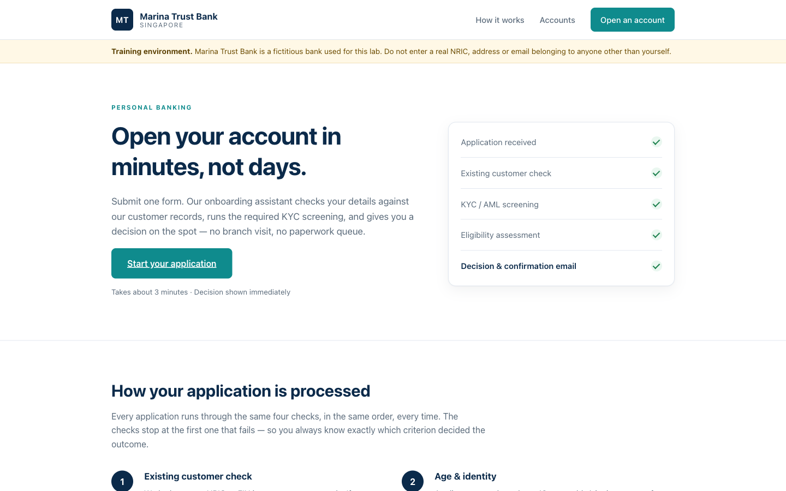
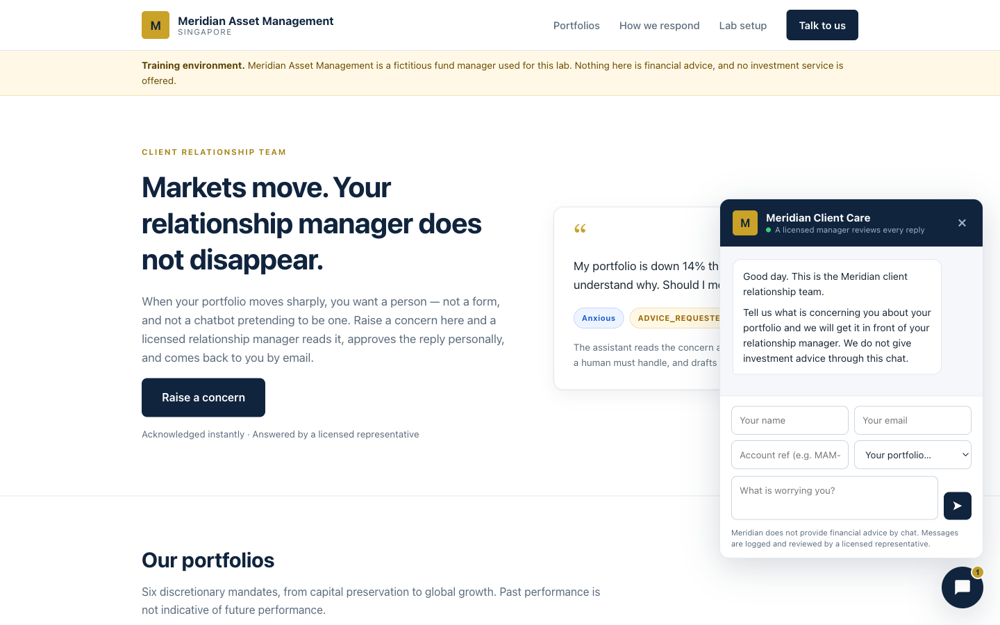
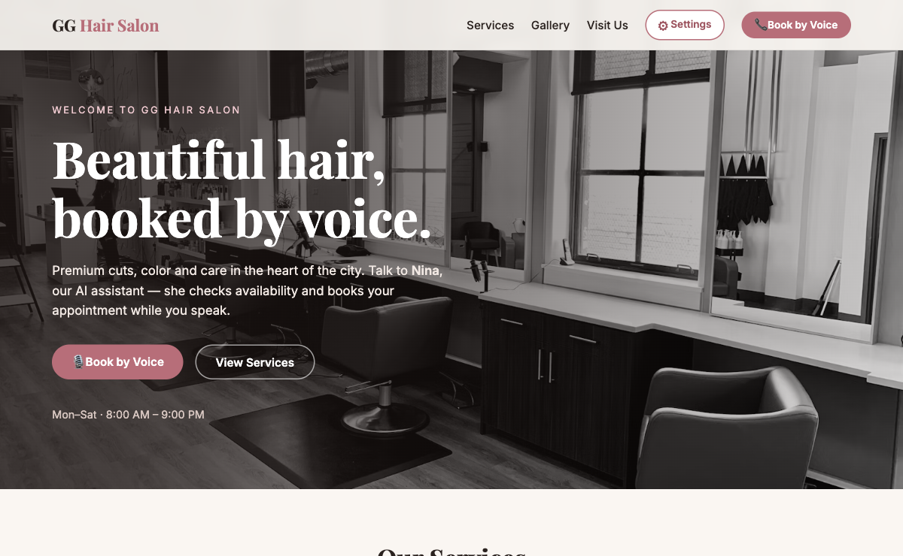
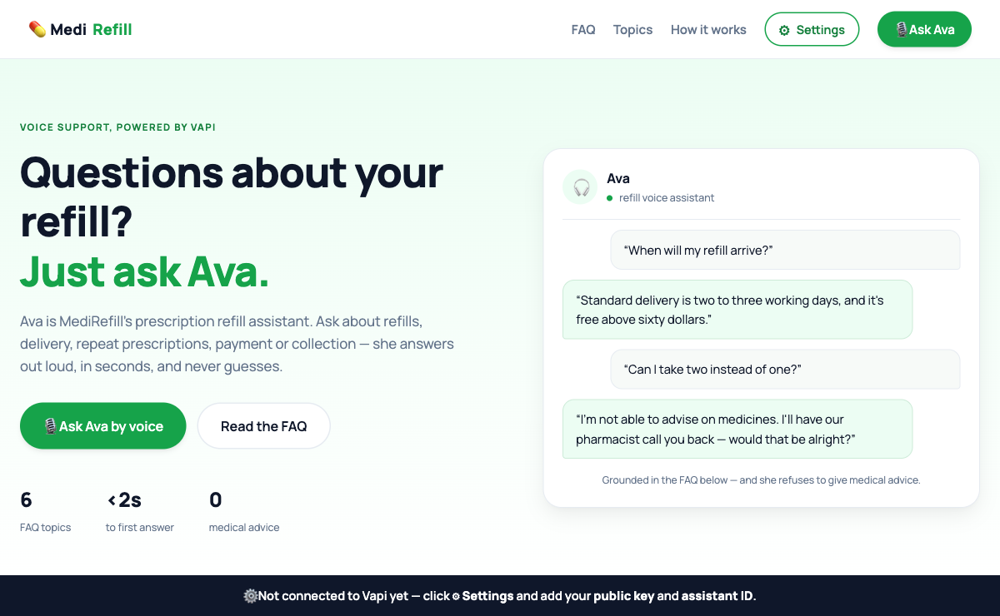

<div align="center">

# No Code and Low Code Agentic AI Applications

[](https://www.tertiarycourses.com.sg/wsq-no-code-and-low-code-agentic-ai-applications.html)
[](https://n8n.io)
[](https://platform.openai.com)
[](#activity-7a--7b--retrieval-augmented-generation-rag)
[](#activity-11--12--voice-agents)
[](#license)

**Hands-on lab workflows and web apps for building agentic AI applications on no-code / low-code platforms — from form-to-email flows to RAG chatbots, human-in-the-loop guardrails, real business use cases, and voice agents with ElevenLabs & Vapi.**

[📘 Course Page](https://www.tertiarycourses.com.sg/wsq-no-code-and-low-code-agentic-ai-applications.html) · [📖 Step-by-Step Guide](LEARNER-GUIDE.md) · [🐛 Report Bug](https://github.com/tertiarycourses/TGS-2026062147-No-Code-and-Low-Code-Agentic-AI-Applications/issues) · [💡 Request Feature](https://github.com/tertiarycourses/TGS-2026062147-No-Code-and-Low-Code-Agentic-AI-Applications/issues)


</div>

> [!NOTE]
> **These are the official hands-on lab materials for the WSQ course:**
> ### 🎓 WSQ — No Code and Low Code Agentic AI Applications
> **Course Code:** `TGS-2026062147` · 4 days / 32 hours · by Tertiary Courses / Tertiary Infotech
> **Course page:** https://www.tertiarycourses.com.sg/wsq-no-code-and-low-code-agentic-ai-applications.html

---

## Lab Activities

**Activity 1 — Flyer with QR Code** · Form Trigger → Gmail + a QR code on an event flyer.


**Activity 2 — Capture Submissions in a Data Table** · Every form submission saved to an n8n Data Table alongside the email.


**Activity 3 — Conditional Response** · IF-node routing: "Yes" saves to a Data Table (3a) / Google Sheets (3b); "No" sends a thank-you email.


**Activity 4 — Telegram AI Agent** · Telegram-triggered AI agent with memory (4a) + a Data Table tool for HR lookups (4b).


**Activity 5 — Website Chatbot via Webhook (Investment Advisor)** · A public landing page with an enquiry form and a floating AI chatbot, each wired to its own n8n webhook. Enquiries are emailed to an admin inbox; the chat is answered by an AI agent. Both are configured from a **⚙ Setup** menu on the page — no code editing.


**Activity 6 — Finance API → Telegram (AI Day Trader)** · Pulls Twelve Data candles + NewsAPI headlines, then replies with a Buy/Sell/Hold call. A live dashboard shows the chart and quote stats.


### Activity 7a & 7b — Retrieval-Augmented Generation (RAG)

**Activity 7a — RAG Chatbot: Upload a PDF, Ask in Telegram** · A web page extracts text from a PDF (an IT-Support FAQ) and uploads it to n8n, which embeds it into an in-memory vector store with Google Gemini. A Telegram bot then answers **only** from that document.


**Activity 7b — Customer-Support RAG Agent (Cook & Bake Academy)** · Ingest 20 course brochures from Google Drive into a **vector database**, then a CX Agent answers website-chat questions about course duration, fees, and schedule — grounded in the brochures. Shown across **three** vector stores: **Supabase (pgvector)**, **Pinecone**, and **Qdrant**.


**Activity 8 — HR Service Portal (Human in the Loop & Guardrails)** · One portal backed by three workflows: human-in-the-loop leave approval (8a), a live leave-balance dashboard (8b), and an AI chatbot wrapped in input/output guardrails (8c).


### Activity 9 & 10 — Use Cases of Agentic AI

**Activity 9 — Retail Banking Customer Onboarding Agent (Marina Trust Bank)** · An AI Agent screens account applications: duplicate check by NRIC, KYC/PEP screening, eligibility rules, record creation, applicant email, and a deterministic audit log — first behind an n8n Form, then behind a real bank website via a Webhook.


**Activity 10 — Client Rapport Assistant with Human Handover (Meridian Asset Management)** · The agent classifies a worried client's message, reads its tone and drafts a strictly non-advisory reply — but **sends nothing** until a licensed relationship manager clicks Approve. Declined drafts land in a human handover queue; three sheet tabs keep the audit trail.


### Activity 11 & 12 — Voice Agents

**Activity 11 — Voice Booking Agent with ElevenLabs (GG Hair Salon)** · Nina answers by voice, quotes real prices from the salon-handbook PDF in her Knowledge Base, checks a real Google Calendar and books real appointments through n8n tool webhooks. The browser only ever receives a short-lived **signed URL** — never your API key.


**Activity 12 — Grounded FAQ Voice Agent with Vapi (MediRefill)** · Ava's brain **is your n8n workflow** (Vapi Custom LLM). She answers only from six FAQ topics and hard-refuses all medical advice with fixed wording plus a pharmacist callback; emergencies escalate to 995 / A&E.


---

## About

This repository contains the complete, working lab materials for the **WSQ No Code and Low Code Agentic AI Applications** course (**TGS-2026062147**) by Tertiary Courses / Tertiary Infotech. Each activity is a self-contained, importable [n8n](https://n8n.io) workflow — several paired with a polished HTML front end — building progressively over four days from basic automation to RAG, human-in-the-loop guardrails, real business use cases, and voice agents.

### What you'll learn

| # | Activity | Concepts |
|---|----------|----------|
| **1** | **Flyer with QR Code** | Form Trigger → Gmail, expressions, QR-code generation |
| **2** | **Capture Data in a Data Table** | n8n Data Tables, storing submissions |
| **3a / 3b** | **Conditional Response** | IF-node branching → Data Table (3a) / Google Sheets persistence (3b) |
| **4a / 4b** | **Telegram AI Agent** | Telegram Trigger, AI Agent, memory, Data Table tool |
| **5** | **Website Chatbot (Investment Advisor)** | Webhook trigger, CORS, `Respond to Webhook`, branded front end |
| **6** | **Finance API → Telegram (Day Trader)** | HTTP Request, Twelve Data + NewsAPI, multi-timeframe analysis |
| **7a** | **RAG Chatbot (PDF → Telegram)** | PDF upload, embeddings (Gemini), in-memory vector store, retrieve-as-tool |
| **7b** | **Customer-Support RAG Agent** | Google Drive ingestion, vector databases — Supabase, Pinecone (Gemini embeddings), Qdrant |
| **8a / 8b / 8c** | **HR Service Portal (HITL & Guardrails)** | Human-in-the-loop approval, live dashboard, pre/post LLM guardrails |
| **9** | **Retail Banking Onboarding Agent** | Use case: agent decisions vs deterministic steps, Sheets tools, audit log, webhook front door |
| **10** | **Client Rapport Assistant** | Use case: human handover (Send & Wait), non-advisory drafting, three-tab audit trail |
| **11** | **Voice Booking Agent (ElevenLabs)** | Signed URLs, agent tool webhooks, Google Calendar, knowledge-base grounding |
| **12** | **Grounded FAQ Voice Agent (Vapi)** | Custom LLM (n8n as the brain), public vs private keys, fixed safety refusals |
| **Capstone** | **Mini Capstone** | End-to-end build (Issue Reporting: form + image → Postgres + gallery) |

> 📖 **Full walkthrough:** see **[LEARNER-GUIDE.md](LEARNER-GUIDE.md)** for detailed, click-by-click instructions (with workflow diagrams) for every activity. Slides, the Learner Guide and the Lesson Plan are in [`courseware/`](courseware/).

---

## Tech Stack

| Category | Technology |
|----------|------------|
| **Automation Platform** | [n8n](https://n8n.io) (cloud trial or local Docker; workflows, triggers, Data Tables) |
| **LLM** | OpenAI (chat + `text-embedding-3-small`) and Google Gemini (chat + `gemini-embedding-001`) |
| **Agent Framework** | n8n LangChain nodes (AI Agent, Memory, Vector Store, Tools) |
| **Vector Databases** | In-memory store · Supabase (pgvector) · Pinecone · Qdrant |
| **Voice Platforms** | ElevenLabs Conversational AI · Vapi (Custom LLM + Web SDK) |
| **Chat / Messaging** | Telegram (Bot trigger + send) |
| **APIs & Data** | Twelve Data + NewsAPI (HTTP Request), Google Drive, Google Calendar |
| **Email / Storage** | Gmail (OAuth2), Google Sheets |
| **Front End** | Vanilla HTML / CSS / JavaScript (no build step), PDF.js |
| **Courseware** | Slides (`python-pptx`), Learner Guide + Lesson Plan (`python-docx`) |

---

## Architecture

```
DAY 1 — Fundamentals of n8n + AI Agents
  Act 1  Form Trigger ─▶ Gmail                         (flyer + QR code)
  Act 2  Form Trigger ─▶ Gmail + Data Table            (capture data)
  Act 3a Form ─▶ IF ─▶ Data Table / Gmail              (conditional)
  Act 3b Form ─▶ IF ─▶ Google Sheets / Gmail           (persistent)
  Act 4a Telegram ─▶ AI Agent (+ memory) ─▶ reply
  Act 4b Telegram ─▶ AI Agent + Data Table tool ─▶ reply

DAY 2 — Webhook and HTTP Request · RAG
  Act 5  Website ─▶ Webhook ─▶ AI Agent ─▶ Respond      (Investment Advisor)
  Act 6  Telegram ─▶ HTTP (Twelve Data + NewsAPI) ─▶ AI Agent ─▶ reply  (Day Trader)
  Act 7a Web upload ─▶ Embeddings (Gemini) ─▶ Vector Store │ Telegram ─▶ Agent + knowledge_base ─▶ reply
  Act 7b Drive ─▶ split ─▶ Embeddings ─▶ Supabase / Pinecone / Qdrant │ Website ─▶ Webhook ─▶ CX Agent ─▶ reply

DAY 3 — Human in the Loop and Guardrails · Use Cases of Agentic AI
  Act 8a Form ─▶ Manager Approval (Send & Wait) ─▶ IF ─▶ confirm / decline
  Act 8b Webhook ─▶ Code ─▶ Respond JSON (leave dashboard)
  Act 8c Webhook ─▶ Input guardrail ─▶ AI Agent ─▶ Output guardrail ─▶ Respond / Blocked
  Act 9  Bank site ─▶ Webhook ─▶ Normalise ─▶ AI Agent (+3 Sheets tools) ─▶ Log ─▶ Respond   (onboarding)
  Act 10 Chat widget ─▶ Webhook ─▶ Rapport Agent ─▶ Draft ─▶ RM Approval ─▶ Send / Handover  (human gate)

DAY 4 — Voice Agents · Mini Capstone
  Act 11 Browser ─▶ n8n (signed URL) ─▶ ElevenLabs agent ─▶ tool webhooks ─▶ Google Calendar
  Act 12 Browser ─▶ Vapi (public key) ─▶ your n8n webhook (Custom LLM) ─▶ AI Agent ─▶ voice reply
  Capstone  Issue Reporting: Form + image ─▶ Postgres + retrieval API + gallery
```

---

## Project Structure

```
TGS-2026062147-No-Code-and-Low-Code-Agentic-AI-Applications/
├── LEARNER-GUIDE.md                  # Full step-by-step lab guide (start here)
├── README.md
├── screenshot.png                    # Cook & Bake Academy RAG site (Activity 7b)
│
├── labs/                             # All hands-on lab activities (one folder each)
│   ├── n8n-installation/             # Docker Compose for self-hosting n8n
│   ├── activity1-flyer-form/         # Act 1: Form → Gmail (+ flyer samples)
│   ├── activity2-data-table/         # Act 2: + Data Table
│   ├── activity3-conditional/        # Act 3a/3b: IF → Data Table / Google Sheets
│   ├── activity4-telegram-agent/     # Act 4a/4b: Telegram AI agent
│   ├── activity5-investment-advisor/ # Act 5: Webhook website chatbot (HTML app)
│   ├── activity6-finance-advisor/    # Act 6: Finance API → Telegram (HTML dashboard)
│   ├── activity7-rag/                # Act 7a/7b: RAG — PDF→Telegram + vector-DB CX agent
│   ├── activity8-guardrails/         # Act 8a/8b/8c: HR Service Portal + guardrails
│   ├── activity9-banking-onboarding/ # Act 9: onboarding agent (form-version/ + website-version/)
│   ├── activity10-client-rapport/    # Act 10: client rapport assistant + human handover
│   ├── activity11-voice-elevenlabs/  # Act 11: ElevenLabs voice booking (GG Hair Salon)
│   ├── activity12-voice-vapi/        # Act 12: Vapi grounded FAQ voice agent (MediRefill)
│   └── mini-capstone/issue-tracking/ # Capstone: Form + image → Postgres + gallery
│
├── assessment/                       # WA (SAQ) + PP question papers (keys are trainer-only)
└── courseware/                       # Course slides, Lesson Plan + Learner Guide
    ├── No Code and Low Code Agentic AI Applications-v1.pptx   # 4-day slide deck (+ PDF)
    ├── LG-No Code and Low Code Agentic AI Applications.docx   # detailed step-by-step (+ PDF)
    └── LP-No Code and Low Code Agentic AI Applications.docx   # 4-day lesson plan (+ PDF)
```

---

## Getting Started

### Prerequisites
- An [**n8n**](https://n8n.io) account (Cloud or self-hosted via [`labs/n8n-installation/`](labs/n8n-installation/))
- An [**OpenAI API key**](https://platform.openai.com/api-keys) and/or a [**Google Gemini key**](https://aistudio.google.com/) (embeddings + chat)
- A **Telegram bot token** (from [@BotFather](https://t.me/BotFather))
- A **Gmail** account (emails + human-in-the-loop approvals) and a **Google account** (Sheets, Drive, Calendar)
- *(Activity 6)* free [Twelve Data](https://twelvedata.com) + [NewsAPI](https://newsapi.org) keys
- *(Activity 7b)* one vector database — [Supabase](https://supabase.com), [Pinecone](https://pinecone.io) or [Qdrant](https://qdrant.io)
- *(Activities 11–12)* an [ElevenLabs](https://elevenlabs.io) API key and a [Vapi](https://vapi.ai) account (public key)

### 1. Clone the repo
```bash
git clone https://github.com/tertiarycourses/TGS-2026062147-No-Code-and-Low-Code-Agentic-AI-Applications.git
cd TGS-2026062147-No-Code-and-Low-Code-Agentic-AI-Applications
```

### 2. Import a workflow into n8n
1. In n8n: **Workflows → Add workflow → ⋯ → Import from File**.
2. Pick a `.json` from the matching `labs/activity*/` folder.
3. Re-select **your own credentials** on each node — imported credential IDs won't match yours.
4. **Save**, then toggle **Active / Published**.

### 3. Run the web apps (Activities 5–12)
The pages are pure static HTML — just open them, or serve locally:
```bash
cd labs/activity9-banking-onboarding/website-version
python3 -m http.server 8000
# then open http://localhost:8000/index.html
```
- Set the webhook / production URL in each page — most pages expose it in the UI (Activity 5 has a **⚙ Setup** menu in the top-right with separate fields for the enquiry webhook, the chat webhook and the admin email, each with its own Test button; others use a gear icon), so you don't have to edit `script.js`. The values are remembered in your browser.
- **Voice labs:** the vendor's servers must reach your n8n — use your n8n Cloud Production URLs, or expose a local n8n with `ngrok http 5678`.

> ⚠️ **CORS:** each n8n Webhook node must have **Options → Allowed Origins (CORS) = `*`** so the browser page can call it. All 14 webhook nodes across the lab exports in this repo already include this — it matters most when you open a page directly from disk (`file://`), because the browser then sends `Origin: null` and a webhook without CORS silently rejects the call.

> 💡 **Two webhooks may never share one path.** n8n refuses to register the second, and that branch silently never fires — a common cause of "my webhook doesn't work". Give each Webhook node its own path (e.g. Activity 5 uses `investment-enquiry` and `investment-chat`).

For complete, click-by-click setup, see **[LEARNER-GUIDE.md](LEARNER-GUIDE.md)**.

---

## Contributing

Contributions, fixes, and improvements are welcome:

1. **Fork** the repository
2. Create a feature branch (`git checkout -b feature/improvement`)
3. Commit your changes and open a **Pull Request**

---

## License

These materials are provided for **educational use** with the WSQ course *No Code and Low Code Agentic AI Applications* (TGS-2026062147) by Tertiary Courses / Tertiary Infotech Academy Pte Ltd.

---

## Acknowledgements

- [n8n](https://n8n.io) — the fair-code workflow automation platform
- [OpenAI](https://openai.com) · [Google Gemini](https://ai.google.dev) — LLMs and embeddings
- [ElevenLabs](https://elevenlabs.io) · [Vapi](https://vapi.ai) — voice agent platforms
- [Supabase](https://supabase.com) · [Pinecone](https://pinecone.io) · [Qdrant](https://qdrant.io) — vector databases
- Tertiary Infotech Academy Pte Ltd — course design and delivery
